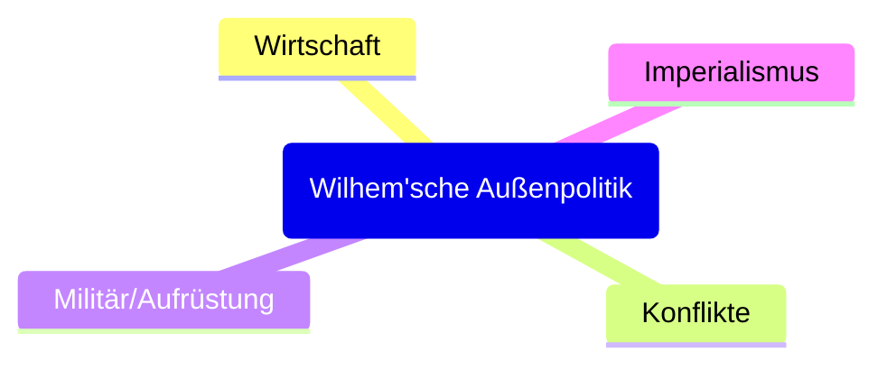

# Wilhem'sche Außenpolitik

Erkläre den "Neuen Kurs" Wilhelms II. und dessen Auswirkungen. Berücksichtige folgende Faktoren

- Wirtschaft
- Konflikte
- Imperialismus
- Militär

## Form

```mermaid
mindmap(Wilhem'sche Außenpolitik)
 Wirtschaft
 Konflikte
 Militär/Aufrüstung
 Imperialismus
```
